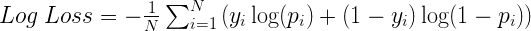

## **ATENÇÃO**: [Grupo do Telegram](https://t.me/mineration) criado para interação entre competidores e organização do desafio!

# Desafio Senac 2018

## Descrição

A mineração de textos é uma ferramenta preditiva que tem se desenvolvido nos últimos anos, conseguindo capturar informações relevantes a partir de uma grande massa de dados.

Esta competição tem como objetivo criar um modelo preditivo que seja capaz de identificar avaliações ruins de restaurantes a partir do texto de comentários postados na internet. 

Os arquivos são os seguintes:

- [avaliacoes_train.csv](data/avaliacoes_train.csv): dados para treinamento;
- [avaliacoes_test.csv](data/avaliacoes_test.csv): dados para envio da resposta.

Os campos são os seguintes:

- **ID**: identificador único do comentário;
- **Titulo**: título encontrado no comentário;
- **Texto**: texto do comentário;
- **Avaliacao**: avaliação do comentário, sendo **0** para uma avaliação boa e **1** para avaliações ruins.

O arquivo para envio da resposta não possui o campo **Avaliação**.

O script RMarkdown [Kernel_w2c.Rmd](src/Kernel_w2c.Rmd) demonstra o processo de modelagem e criação do arquivo de resposta e pode ser utilizado como ponto de partida. 

## Avaliação

Nesta competição, as respostas serão avaliadas utilizando a função [Log Loss](http://mariofilho.com/as-metricas-mais-populares-para-avaliar-modelos-de-machine-learning/):

Sendo que para _Log Loss_, quanto menor o valor obtido, melhor. Em caso de empate, prevalecerá o envio mais antigo.

Durante o período da competição, será disponibilizado somente o _Log Loss_ de uma amostra da base de teste, em caráter de prévia. A pontuação definitiva será disponibilizada somente após o encerramento da competição.

## Premiação

Bolsa parcial de estudos para cursar a Pós-graduação em Big Data Analytics na Faculdade Senac, válida para matrícula realizada em até 30 dias após o resultado da competição:

**1º lugar**: 40% de desconto

**2º lugar**: 30% de desconto

**3º lugar**: 20% de desconto

O prêmio é pessoal e intransferível. Caso um mesmo competidor obtenha mais de uma colocação vencedora, ele receberá somente a maior premiação. A premiação subsequente será disponibilizada para o próximo melhor competidor e assim por diante.

## Regras

Cada pessoa registrada é referida como "Participante". Você só pode participar usando uma  conta Mineration exclusivamente registrada em http://www.mineration.com. 

### Quem pode participar

Qualquer pessoa acima de 18 anos, observando que para usufruir do prêmio é preciso que o participante tenha graduação em qualquer curso superior.

### Disponibilização do modelo

Para recebimento da premiação, os competidores  deverão disponibilizar o código-fonte do modelo utilizado para a criação da resposta, enviando-o a um e-mail a ser disponibilizado posteriormente nesse regulamento. Os scripts dos vencedores serão tornados públicos neste repositório.

Os modelos podem ser criados nas linguagens **R** ou **Python**, podendo fazer uso de quaisquer bibliotecas, desde que gratuitas.

### Uma pessoa por conta

Cada premiação será dada a somente uma pessoa, mesmo que o trabalho tenha sido realizado em grupo.

### Limites de Envios de Respostas

Só poderá ser realizado um envio de resposta por hora.

## Código de Conduta

Além dos comportamentos definidos pelas regras da competição, "trapacear" abrange qualquer tentativa de obter uma vantagem na precisão usando informações que estão fora do conjunto de dados fornecido ou uma tentativa de usar as informações fornecidas de uma forma que não é pretendida.

Exemplos de trapaça incluem (mas não estão limitados a):

- Tentativa de usar conjuntos de dados e referências além daquelas disponibilizadas pela concorrência;
- Tentativa de abusar da infraestrutura de competição para ganhar vantagem.

Observe que o Senac se reserva o direito, mas não tem a obrigação, de revisar o código enviado para desqualificar quaisquer contribuições que demonstrem fraude e o Senac se reserva o direito de determinar o que acredita, a seu exclusivo critério, constituir trapaça. Nós respeitosamente pedimos que você se abstenha de fazer uso de comportamentos condenáveis.

Embora o Senac se reserve o direito de tomar medidas eficazes para detectar e desqualificar a fraude, pedimos que você cumpra pessoalmente o código de conduta e comportamento ético aceitável na sua participação. Vemos esta competição como uma oportunidade de aprendizado única para todos nós, igualmente para os organizadores e os competidores e esperamos sinceramente que você se junte a nós nessa meta, com seus esforços mais legítimos.

## Prazos

A Competição acontecerá a partir da data de início até a data final, conforme se segue:

- Início: **10/11/2018 às 12:00**.
- Encerramento: **24/11/2018 às 12:00**.
- Divulgação dos Vencedores: **26/11/2018 a partir das 12:00**.

Note que os prazos da Competição estão sujeitos a alterações e prazos adicionais para os obstáculos podem ser introduzidos durante a Competição. Quaisquer prazos adicionais ou alterados, ainda não descritos nestas Regras da Competição, serão divulgados aos Participantes nessa mesma página. 

É responsabilidade do Participante nesta competição verificar o site regularmente durante toda a Competição para se manter informado sobre quaisquer prazos novos ou atualizados. 

## Instruções para Envio de Respostas

Para cada amostra no arquivo de teste, você deve prever a probabilidade do comentário ter sido bom ou ruim. O arquivo com as predições a ser enviado para o site www.mineration.com deve ser em formato **CSV**, sem título de campos como no exemplo a seguir:

    1,0.63
    2,0.05
    3,1.0
    4,0.0
    ...

onde o primeiro campo é o "ID" da amostra e o segundo é a probabilidade.

**Atenção!** Não deve ser enviado para o site www.mineration.com o arquivo de script que gerou as respostas, somente o CSV.

## Suporte

Eventuais problemas devem ser cadastrados no Github, aba [Issues](https://github.com/mineration/desafio-senac-2018/issues).
